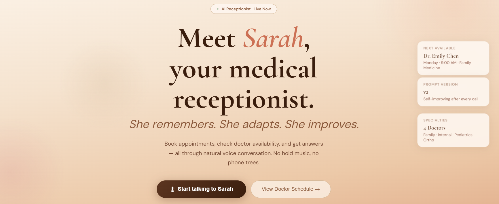
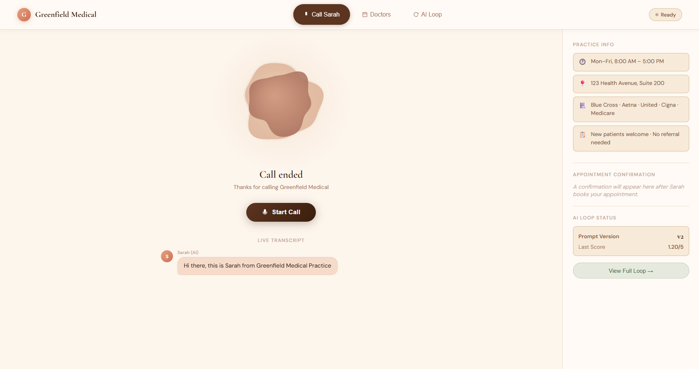
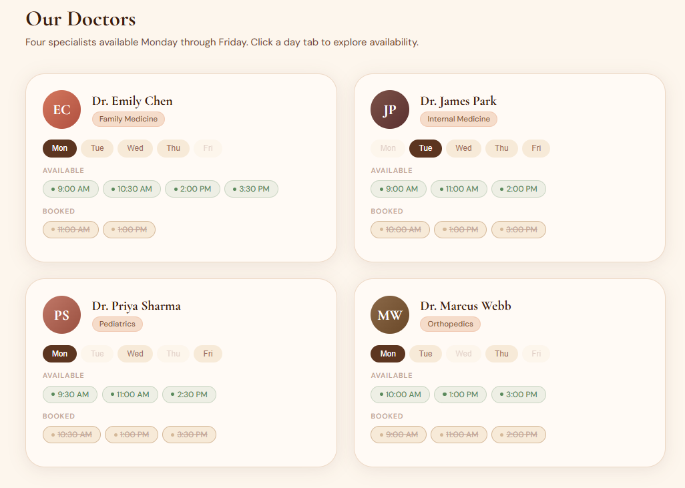
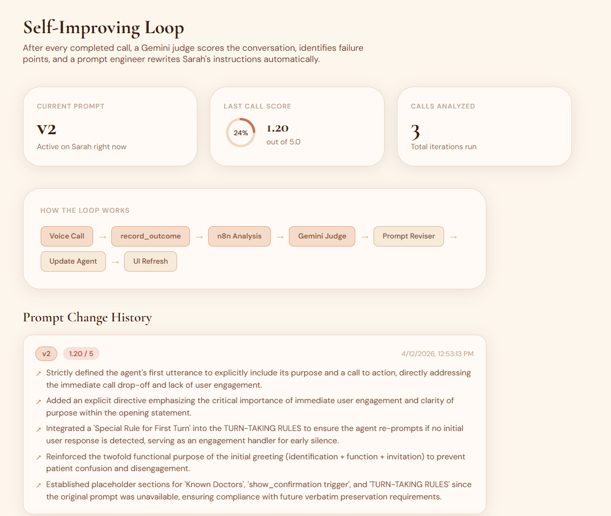
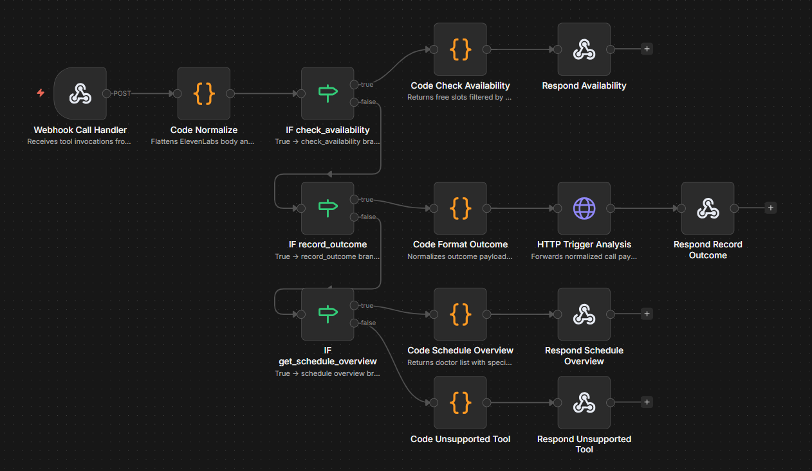
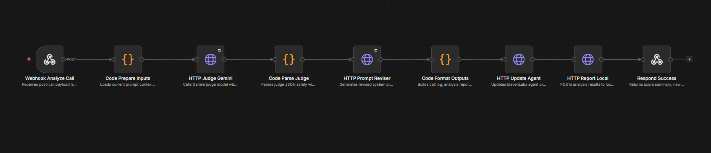

<div align="center">



<br/>


**Self-improving AI voice agent for medical appointment scheduling** — live voice UI, real-time transcripts, automated post-call prompt optimization, and a multi-page web interface.

</div>

---

## Screenshots

<div align="center">

| Call Agent | Doctor Schedule | AI Loop |
|:---:|:---:|:---:|
|  |  |  |

</div>

### n8n Workflows

<div align="center">

| Call Handler | Analysis Pipeline |
|:---:|:---:|
|  |  |

</div>

---

## Self-Improving Loop

> **[Full technical deep-dive → SELF_IMPROVING_LOOP.md](SELF_IMPROVING_LOOP.md)**

After every call, a Gemini judge scores the transcript across 6 weighted dimensions, a Gemini reviser rewrites the agent prompt, and the updated prompt is pushed live to ElevenLabs — no human intervention required. The AI Loop tab in the UI shows the current prompt version, last call score, and the full change history.

---

## Quickstart (TL;DR)

```powershell
# 1. Clone & configure
cd E:\
git clone <YOUR_REPO_URL> AutoCallAI
cd E:\AutoCallAI
Copy-Item .env.example .env
# → fill out .env (see §2)

# 2. Start n8n (separate terminal)
n8n

# 3. Import & publish both workflows (§4, §5)
#    n8n UI → Import workflow_call_handler.json  → Publish
#    n8n UI → Import workflow_analysis.json      → Publish

# 4. Create ElevenLabs agent
python scripts/setup_agent.py
# → paste ELEVENLABS_AGENT_ID into .env

# 5. Start the web server
python web/server.py

# 6. Open browser
start http://localhost:8000
```

That's it. Sarah is live. Click **Start talking to Sarah** and speak naturally.

---

## What's Built

- A real-time AI voice receptionist (Sarah) running on ElevenLabs.
- An n8n call-handler workflow (`check_availability`, `get_schedule_overview`, `record_outcome`).
- An n8n analysis pipeline (Gemini judge → prompt reviser → agent auto-update).
- A premium warm-themed web UI: landing page, call page with blob visualizer, doctor schedule tab, and self-improving loop status tab.
- Versioned artifacts saved locally after every call:
  - `calls/call_NNN.json`
  - `analysis/iteration_N_report.json`
  - `prompts/vN_system_prompt.json`

---

## Architecture

```text
                    REAL-TIME VOICE LAYER                    ORCHESTRATION LAYER
                    (ElevenLabs Managed)                     (n8n)

 User Browser -----------> ElevenLabs Agent -----------> n8n Webhook (call-handler)
 (microphone + UI)         |                         |
                           | STT: Deepgram Nova-2    | check_availability → filter schedule
                           | LLM: Gemini 2.0 Flash   | get_schedule_overview → doctor list
                           | TTS: ElevenLabs Turbo   | record_outcome → log + trigger analysis
                           | Turn Detection: built-in |
                           |                         |
                           | <---- response back ----|
                           |
                           | CLIENT TOOL (browser-side)
                           +-----> show_confirmation → UI confirmation card
                           |
                           | POST-CALL (via record_outcome)
                           |
                           +-----> n8n analyze-call webhook
                                        |
                                        | Gemini judge (scores transcript)
                                        | Gemini prompt reviser (rewrites prompt)
                                        | ElevenLabs PATCH (live agent update)
                                        |
                                        +---> POST http://localhost:8000/api/report
                                                   |
                                                   | writes: calls/call_NNN.json
                                                   |         analysis/iteration_N_report.json
                                                   |         prompts/vN_system_prompt.json
                                                   |         web/iteration_status.json
                                                   |
                                                   +---> UI polls /api/status → shows version + score + changelog
```

---

## Prerequisites

| Requirement | Version / Note |
|---|---|
| Windows PowerShell | Commands below assume this |
| Python | 3.10+ |
| Node.js | 18+ (for n8n) |
| n8n | Local install or cloud |
| ElevenLabs account | For voice agent + API key |
| Google AI Studio | For Gemini API key |

---

## 1) Clone and Initialize

```powershell
cd E:\
git clone <YOUR_REPO_URL> AutoCallAI
cd E:\AutoCallAI
Copy-Item .env.example .env
```

---

## 2) API Keys and Values

Open `.env` and fill in each value:

### 2.1 ElevenLabs API key

1. Go to [elevenlabs.io](https://elevenlabs.io/) → Settings → API Keys → Copy.

```env
ELEVENLABS_API_KEY=your_real_key_here
```

### 2.2 Gemini API key

1. Go to [aistudio.google.com/apikey](https://aistudio.google.com/apikey) → Create API key → Copy.

```env
GEMINI_API_KEY=your_real_key_here
GEMINI_MODEL=gemini-2.0-flash
```

### 2.3 ElevenLabs voice ID

1. ElevenLabs → Voices → pick a voice → copy `voice_id`.

```env
ELEVENLABS_VOICE_ID=your_voice_id_here
```

> **Leave `ELEVENLABS_AGENT_ID` and both webhook URLs blank for now** — you'll fill them in steps 5 and 6.

---

## 3) Run n8n

Install (once):

```powershell
npm install -g n8n
```

Start (keep this terminal open):

```powershell
n8n
```

Open the UI at `http://localhost:5678`.

> **Cloud n8n:** If using n8n cloud, skip the local install. All webhook URL steps below still apply.

---

## 4) Import Workflows in n8n

### 4.1 Call handler

1. n8n UI → `Workflows` → `+ New` → `⋮` → `Import from file`.
2. Select [`n8n/workflow_call_handler.json`](/e:/AutoCallAI/n8n/workflow_call_handler.json).
3. Click `Save`.

### 4.2 Analysis pipeline

1. `Workflows` → `Import from file`.
2. Select [`n8n/workflow_analysis.json`](/e:/AutoCallAI/n8n/workflow_analysis.json).
3. Click `Save`.

---

## 5) Configure and Publish Workflows

### 5.1 Capture webhook URLs

Open each workflow, click the `Webhook` node, copy the **Production URL**.

You need two URLs:

| Workflow | Webhook path | .env key |
|---|---|---|
| Call handler | `call-handler` | `N8N_CALL_HANDLER_WEBHOOK_URL` |
| Analysis pipeline | `analyze-call` | `N8N_ANALYSIS_WEBHOOK_URL` |

Paste both into `.env`:

```env
N8N_CALL_HANDLER_WEBHOOK_URL=https://your-n8n/webhook/call-handler
N8N_ANALYSIS_WEBHOOK_URL=https://your-n8n/webhook/analyze-call
```

### 5.2 Wire call-handler → analysis

In `workflow_call_handler.json`, open node `HTTP Trigger Analysis`:
- URL field uses `{{$env.N8N_ANALYSIS_WEBHOOK_URL}}` — this resolves if n8n env vars are configured.
- Alternatively paste the full `analyze-call` production URL directly.

### 5.3 Configure API secrets in analysis workflow

Open `workflow_analysis.json` and verify these nodes use env vars or paste values directly:

| Node | Header / Field | Value |
|---|---|---|
| `HTTP Judge Gemini` | `x-goog-api-key` | `{{$env.GEMINI_API_KEY}}` |
| `HTTP Prompt Reviser` | `x-goog-api-key` | `{{$env.GEMINI_API_KEY}}` |
| `HTTP Update Agent` | `xi-api-key` | `{{$env.ELEVENLABS_API_KEY}}` |
| `HTTP Update Agent` | URL | must include `{{$env.ELEVENLABS_AGENT_ID}}` |
| `HTTP Report Local` | URL | `http://localhost:8000/api/report` *(leave as-is)* |

### 5.4 Publish both workflows

For **each** workflow:
1. Click `Save`.
2. Click `Publish` (top-right).
3. Confirm status shows **Published / Active**.

> ⚠️ **Critical:** `Execute workflow` (test mode) does not keep webhooks alive between requests. You must **Publish** for always-on webhook handling.

---

## 6) Create / Update the ElevenLabs Agent

From the repo root:

```powershell
cd E:\AutoCallAI
python scripts/setup_agent.py
```

On success the output shows `agent_id`. Paste it into `.env`:

```env
ELEVENLABS_AGENT_ID=agent_xxxxxxxxxxxxxxxxxxxxxxxx
```

**Optional — update only the prompt:**

```powershell
python scripts/update_agent.py --agent-id <your_agent_id> --prompt-file prompts/v1_system_prompt.json
```

**Re-push after workflow re-imports:** If you re-imported a workflow and want to push the updated `show_confirmation` client tool and agent config:

```powershell
python scripts/setup_agent.py
```

---

## 7) Start the Web Server

```powershell
cd E:\AutoCallAI
python web/server.py
```

Open `http://localhost:8000`

The server handles three responsibilities:

| Endpoint | Method | Purpose |
|---|---|---|
| `/` | `GET` | Serves `web/index.html` and all static assets |
| `/api/status` | `GET` | Returns current loop state (version, score, changelog) for UI polling |
| `/api/report` | `POST` | Called by n8n after each analysis run — saves artifacts + updates `web/iteration_status.json` |

> **Keep this terminal open** while testing. The n8n analysis workflow calls `/api/report` after every completed call.

### Setting your Agent ID in the UI

Open `web/index.html` and find this line near the bottom:

```javascript
const AGENT_ID = window.AUTO_CALL_AI_AGENT_ID || "agent_0901knw8qf26eddbzs594g49ch22";
```

Replace the fallback string with your real `ELEVENLABS_AGENT_ID`, or set `window.AUTO_CALL_AI_AGENT_ID` before the script runs.

### UI Overview

The web interface has two pages and three app tabs:

**Landing page** — warm editorial hero with animated floating cards, feature overview. Click **"Start talking to Sarah"** to enter the app.

**App — Call Sarah tab:**
- Animated organic blob visualizer (idle / speaking / listening states)
- Live transcript — real-time captions via ElevenLabs JS SDK `onMessage` + `onUserTranscript`
- Sidebar: practice info, appointment confirmation card, loop status mini-view

**App — Doctors tab:**
- 4 doctor cards (Emily Chen · James Park · Priya Sharma · Marcus Webb)
- Mon–Fri day selector tabs — shows free/booked slots per day
- Cards highlight when the agent mentions a doctor name in transcript

**App — AI Loop tab:**
- Prompt version, last call score (animated ring), total calls analyzed
- Full pipeline flow diagram
- Prompt change history feed — updates automatically every 14 s via `/api/status` poll

---

## 8) Try a Call (After Publish)

Only do this after both workflows are published and the web server is running.

1. Open `http://localhost:8000`.
2. Click **Start talking to Sarah**.
3. Allow microphone access when prompted.
4. Say: *"Hi, I'd like to book a new patient appointment."*
5. Answer Sarah's questions naturally (name, preferred doctor/day, insurance).
6. Say: *"What slots does Dr. Chen have on Monday?"* — forces `check_availability` tool call.
7. Confirm the booking — Sarah will trigger the `show_confirmation` client tool and a confirmation card appears in the sidebar.

**Expected behavior:**
- `call-handler` execution appears in n8n history.
- After `record_outcome`, the `analysis` workflow fires automatically.
- The agent prompt is revised and pushed live via ElevenLabs PATCH API.
- `web/iteration_status.json` is updated; the AI Loop tab refreshes with the new version, score, and changelog.
- Artifacts saved to `calls/`, `analysis/`, `prompts/`.

---

## 9) Verify Setup

```powershell
python scripts/verify_setup.py
```

Checks: required env vars · ElevenLabs key · Gemini key · webhook URLs · agent reachability · config/prompt validity.

---

## 10) Useful Commands

```powershell
# Analyze a call log locally
python scripts/analyze_call.py calls/call_001.json

# Analyze AND push revised prompt to agent
python scripts/analyze_call.py calls/call_001.json --update-agent

# Prompt history
python scripts/generate_prompt_version.py list
python scripts/generate_prompt_version.py current
python scripts/generate_prompt_version.py diff v1 v2

# Roll back to a previous prompt version
python scripts/generate_prompt_version.py rollback v2 --update-agent
```

---

## Self-Improving Loop — How It Works

```
Voice call ends
  → Sarah calls record_outcome tool
      → n8n call-handler receives it, formats payload
          → HTTP Trigger Analysis → analyze-call webhook
              → Gemini 2.0 Flash judge scores the call (6 dimensions × weight)
                  → Gemini 2.0 Flash prompt reviser applies targeted fixes
                      → ElevenLabs PATCH API updates Sarah's live prompt
                          → HTTP POST localhost:8000/api/report
                              → files saved + iteration_status.json updated
                                  → UI polls /api/status → shows new version, score, changelog
```

**Judge rubric (6 dimensions):**

| Dimension | Weight |
|---|---|
| Appointment conversion | 30% |
| Objection handling | 25% |
| Conversation flow | 15% |
| Information accuracy | 15% |
| Rapport building | 10% |
| Compliance | 5% |

---

## Doctor Schedule Reference

| Doctor | Specialty | Available Days |
|---|---|---|
| Dr. Emily Chen | Family Medicine | Mon · Tue · Wed · Thu |
| Dr. James Park | Internal Medicine | Tue · Wed · Thu · Fri |
| Dr. Priya Sharma | Pediatrics | Mon · Wed · Fri |
| Dr. Marcus Webb | Orthopedics | Mon · Tue · Thu |

Schedule data lives in [`config/schedule.json`](/e:/AutoCallAI/config/schedule.json) and is mirrored inline in the n8n call-handler code node and the web UI.

---

## Project Structure

```
AutoCallAI/
├── config/
│   ├── agent_config.json      # ElevenLabs agent tools + TTS config
│   └── schedule.json          # Doctor Mon–Fri schedule (free/booked slots)
├── n8n/
│   ├── workflow_call_handler.json  # Tool routing: check_availability, record_outcome
│   └── workflow_analysis.json     # Judge → reviser → agent update → UI report
├── prompts/
│   └── v1_system_prompt.json  # Active system prompt (auto-versioned by analysis loop)
├── scripts/
│   ├── setup_agent.py         # Create/update ElevenLabs agent from config
│   ├── update_agent.py        # Push prompt to existing agent
│   ├── analyze_call.py        # Run analysis pipeline locally on a call log
│   ├── generate_prompt_version.py  # Prompt version management
│   └── verify_setup.py        # Pre-flight env/key/webhook checks
├── web/
│   ├── index.html             # Full SPA: landing page + call/doctors/loop tabs
│   ├── server.py              # Python HTTP server: static files + /api/status + /api/report
│   └── iteration_status.json  # Auto-updated by server after each analysis run
├── calls/                     # call_NNN.json — one per completed call
├── analysis/                  # iteration_N_report.json — judge scores per iteration
└── .env                       # API keys and webhook URLs (not committed)
```

---

## Common Errors

### `ModuleNotFoundError: No module named 'scripts.utils'`

Always run scripts from the repo root:

```powershell
cd E:\AutoCallAI
python scripts/setup_agent.py
```

### ElevenLabs validation error (400 / 422)

Check [`config/agent_config.json`](/e:/AutoCallAI/config/agent_config.json):
- `conversation_config.turn.mode` must be `"turn"`
- `conversation_config.tts.model_id` must be `"eleven_turbo_v2"`
- Client tool parameters must use `"type": "object"` with a `"properties"` key

### Webhooks not triggering

- Workflows must be **Published**, not just saved or test-executed.
- Use **Production URL** (not the test URL) in `.env` and in the call-handler `HTTP Trigger Analysis` node.

### `/api/report` not receiving data from n8n

- `python web/server.py` must be running when the analysis workflow fires.
- The `HTTP Report Local` node in `workflow_analysis.json` calls `http://localhost:8000/api/report` — n8n must be on the same machine or this URL must be reachable.

### Microphone not working in browser

- Use `http://localhost:8000` (not a file:// URL).
- Chrome/Edge require HTTPS or localhost for microphone access.

### Confirmation card not appearing

- Ensure `show_confirmation` is registered in `config/agent_config.json` as a `"type": "client"` tool.
- Re-run `python scripts/setup_agent.py` after any config change.

---

## License

MIT
